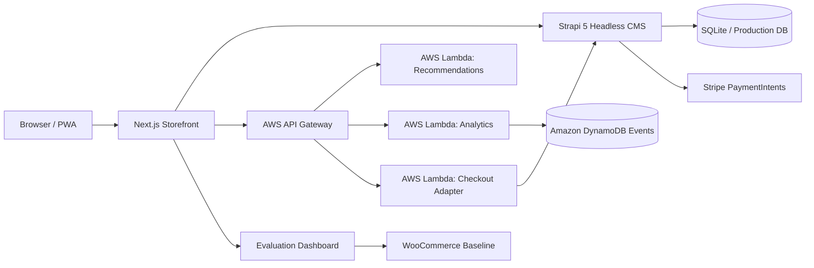

# Strapi Headless E-Commerce Thesis Platform

Next.js 16 storefront for a thesis project on modern e-commerce architectures. The application uses Strapi 5 as a headless CMS, supports embedded Stripe test payments, includes AI-based recommendation and UX experimentation features, and exposes an evaluation dashboard for performance, security, and CMS comparison evidence.

## Live Demo

| Area | URL |
| --- | --- |
| Storefront | https://shop.tagg.gr |
| Evaluation dashboard | https://shop.tagg.gr/evaluation |
| WooCommerce comparison section | https://shop.tagg.gr/evaluation#woocommerce-comparison |
| Comparison JSON export | https://shop.tagg.gr/evaluation/woocommerce-comparison.json |
| Comparison CSV export | https://shop.tagg.gr/evaluation/woocommerce-comparison.csv |
| WooCommerce baseline | https://woo.tagg.gr |

## Implemented Thesis Scope

- Product catalog, product images, search, sorting, stock state, cart, checkout, and order history.
- Strapi 5 backend integration through REST APIs.
- Embedded Stripe PaymentIntents test checkout without redirecting to a Stripe-hosted page.
- PWA assets, manifest, service worker, and offline fallback.
- AI-based recommendation pilot with collaborative-filtering-style signals from user interactions.
- Interaction tracking and A/B testing hooks for UX optimization.
- Evaluation toolkit for latency, Time to First Byte, Lighthouse-style metrics, security headers, and CMS comparison.
- Published comparison against a WooCommerce baseline for performance and security evidence.
- Partial serverless/composable pilot with function-style recommendation, analytics, and checkout service boundaries.

## Repository Structure

```text
app/                  Next.js App Router pages and routes
components/           Shared React UI components
lib/                  API clients, cart/user stores, analytics, recommendations
public/               Static assets and generated evaluation exports
evaluation/           Measurement toolkit and WooCommerce comparison workflow
serverless/           Function-style MACH/serverless demonstration services
docs/                 GitHub-facing installation, architecture, and thesis evidence notes
```

## Quick Start

Install the frontend dependencies:

```bash
npm install
```

Start the Strapi backend from `C:\Users\Thodoris\my-strapi`:

```bash
npm run develop
```

Start the frontend:

```bash
npm run dev
```

Open http://localhost:3000.

For a full reviewer setup, see [docs/INSTALLATION.md](docs/INSTALLATION.md).

## Environment

Create `.env.local` in the frontend project:

```env
NEXT_PUBLIC_STRAPI_URL=http://127.0.0.1:1337
NEXT_PUBLIC_PAYMENT_PROVIDER=stripe
NEXT_PUBLIC_STRIPE_PUBLISHABLE_KEY=pk_test_replace_with_real_publishable_key

# Optional function-style endpoints
NEXT_PUBLIC_RECOMMENDATIONS_URL=http://127.0.0.1:8787/recommendations
NEXT_PUBLIC_ANALYTICS_URL=http://127.0.0.1:8787/track
NEXT_PUBLIC_CHECKOUT_URL=http://127.0.0.1:8787/checkout
NEXT_PUBLIC_ANALYTICS_SUMMARY_URL=http://127.0.0.1:8787/analytics/summary
```

Add Stripe secrets only to the Strapi backend `.env`:

```env
STRIPE_SECRET_KEY=sk_test_replace_with_real_secret_key_from_stripe_dashboard
```

Never commit real secrets or production `.env` files.

## Architecture



More detail is available in [docs/ARCHITECTURE.md](docs/ARCHITECTURE.md).

## Useful Commands

```bash
npm run dev
npm run build
npm run lint
npm run serverless:demo
npm run evaluate
```

From the Strapi backend project:

```bash
npm run seed:demo
```

## Evaluation Evidence

The evaluation dashboard publishes measurement results and exportable comparison data. The thesis evidence mapping is summarized in [docs/THESIS_EVIDENCE.md](docs/THESIS_EVIDENCE.md), while the detailed toolkit workflow lives in [evaluation/README.md](evaluation/README.md).

## Deployment

Production deployment notes for Plesk, public URLs, runtime configuration, and build constraints are documented in [DEPLOYMENT.md](DEPLOYMENT.md).

## Serverless / MACH Pilot

The project includes a partial composable architecture pilot under [serverless/](serverless/). It demonstrates how recommendations, analytics, and checkout can be separated into AWS-style function services while the current production system remains compatible with the Strapi backend. The intended cloud mapping is API Gateway for HTTP routing, AWS Lambda for independent service execution, and DynamoDB for interaction-event storage.

Run the local adapter:

```bash
npm run serverless:demo
```

Then set the optional endpoint variables shown above.

## Stripe Test Payments

The checkout uses Stripe test mode. For interactive testing use card `4242 4242 4242 4242`, any future expiry date, any CVC, and any postal code. The browser confirms the card with Stripe.js, while Strapi verifies the PaymentIntent and stores the paid order.
