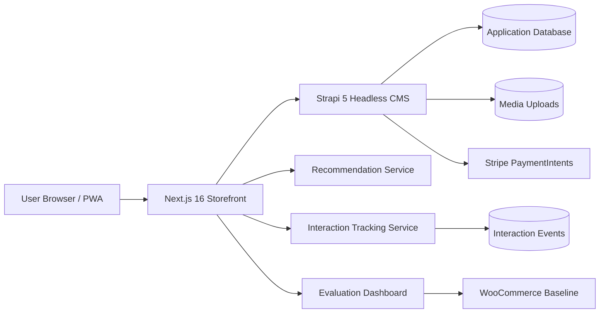

# Architecture Overview

The project implements a headless e-commerce architecture with a Next.js frontend, a Strapi backend, external payment processing, and experimental function-style services.

## Runtime View

## Main Components

| Component | Responsibility |
| --- | --- |
| Next.js frontend | Storefront UI, routing, cart state, checkout UI, evaluation dashboard, PWA behavior |
| Strapi backend | Product, media, user, order, payment, and admin content management |
| Stripe PaymentIntents | Test payment authorization inside the checkout flow |
| Recommendation service | Product ranking based on product and interaction signals |
| Interaction tracking | Captures product views, cart actions, and UX experiment events |
| Evaluation toolkit | Measures latency, TTFB, page performance, headers, and CMS comparison data |
| WooCommerce baseline | Reference CMS implementation used for comparative evaluation |

## MACH / Composable Mapping

| MACH Principle | Project Implementation |
| --- | --- |
| Microservices | Recommendations, analytics, and checkout are separated behind independent service endpoints in the pilot |
| API-first | Frontend communication happens through Strapi REST APIs and optional function endpoints |
| Cloud-native | Production frontend/backend are deployed online; serverless service boundaries are prepared for cloud functions |
| Headless | Presentation is handled by Next.js while content and commerce entities are managed by Strapi |

## Current Architectural Boundary

The implemented platform is intentionally hybrid. The production application remains stable through Strapi and Next.js, while the `serverless/` folder demonstrates how selected capabilities can be extracted into composable services. This supports the thesis argument without requiring a full rewrite of the e-commerce system.

## What This Architecture Provides

- Independent frontend evolution without changing the CMS admin experience.
- Clear separation between content management, checkout, recommendations, and analytics.
- Easier comparison with traditional CMS platforms because the evaluation toolkit treats each platform as an observable storefront.
- Safer experimentation: A/B testing and recommendations can be added or disabled through endpoints and environment variables.
- A practical migration path toward serverless and composable services.

## Known Limitations

- The serverless implementation is a pilot and not a complete production migration.
- Local and production measurements may differ depending on hosting load, cache state, and network conditions.
- WooCommerce comparison results should be interpreted as measurements of the configured demo environments, not universal platform benchmarks.

